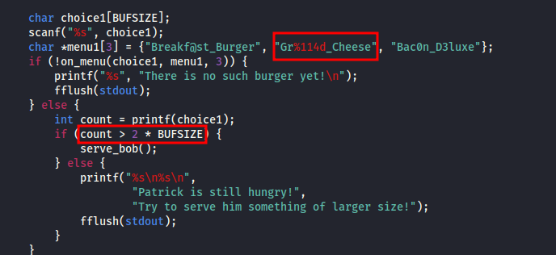
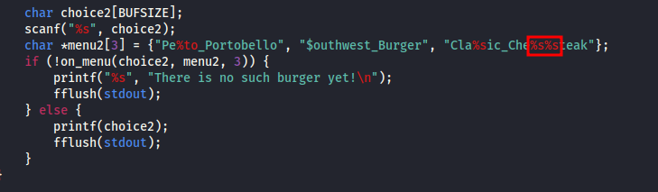

# ANALYSIS
This challenge has a format string vulnerability. We are given tow files, that contain the code.  
After opening the code, we notice that the vulnerability is related to the buffersize, since the variable count is compared with it.  
  

# SOLUTION
The `%` symbols will help us solve this challenge.  
In the first comparison, the correct answer is `Gr%114d_Cheese`, since when the program reads the symbols `%114d`, it expects an integer with 114 digits. Since this is not true, the program loads with trash. But the count has increased rapidly so the program continues.  
  

  
  

Then, the program asks for another input. This time the correct answer is `Cla%sic_Che%s%steak`. The `%s` specifier expects a string. But the string **stake** is invalid, so the program crashes. This way, it gives us the flag.  
  

  
  

* Flag: picoCTF{7h3_cu570m3r_15_n3v3r_SEGFAULT_74f6c0e7}
