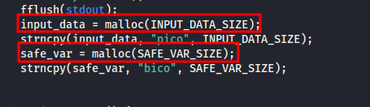
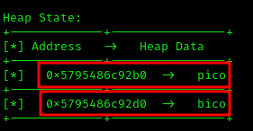
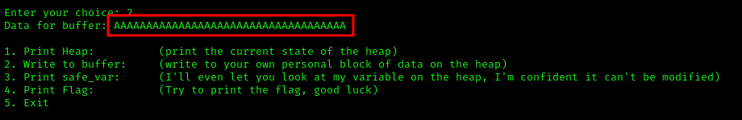
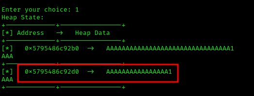
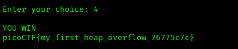

# ANALYSIS
This challenge has a buffer overflow. We are given two files, one executable and one source code.  
  

# SOLUTION
In the code, we see that the variable `safe_var` is created after the variable `input_data`.  
  

  
  

At the start of the code, we notice that every variable has a specific length of 5 bytes. So, we give more than 5 bytes to `input_data` so that we also change the `safe_var`.  
First, we nc to the remote machine and press 2 to change the **input_data**. But if we give a long string like **ΑΑΑΑΑΑΑΑΑΑΑΑΑΑΑΑΑΑΑΑΑΑΑΑΑΑΑΑΑΑΑΑΑΑΑΑ**, we will also change `safe_var`.  
The following images show the correct steps to get the flag.  
  

  
  
  
  
  

* Flag: picoCTF{my_first_heap_overflow_76775c7c}
