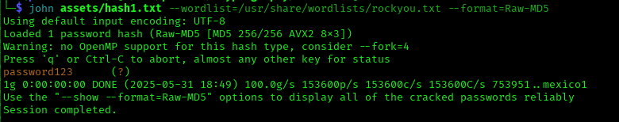
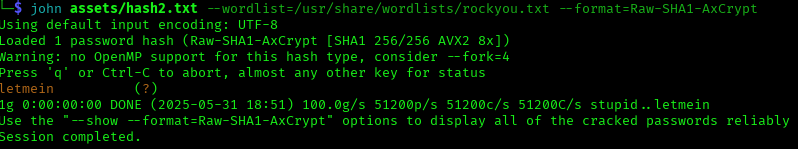
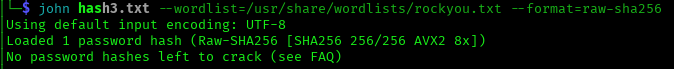
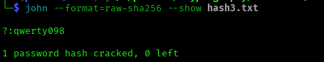
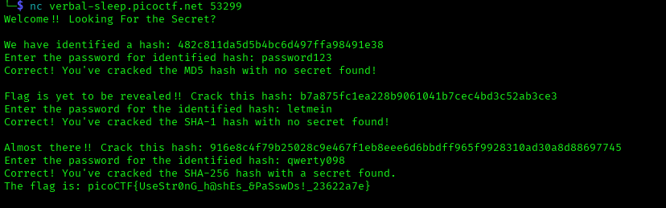

# ANALYSIS
To solve this challenge we need to connect to a remote server with netcat command given.
  

# SOLUTION
After connecting to the server we are asked to decrpyt some hashes. `Johntheripper` can be consider a useful tool.  

The first hash is md5.
  
  

The second one is sha1
  

  

The third one is a sha256 hash.
  

  
  

  
  
At the end, we will get this result.
  

  

* Flag: picoCTF{UseStr0nG_h@shEs_&PaSswDs!_23622a7e}