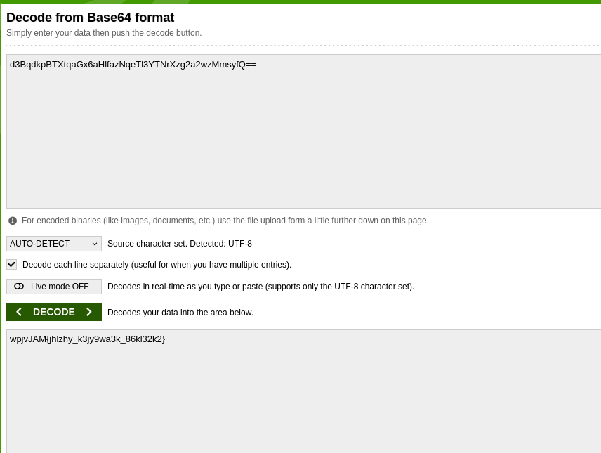
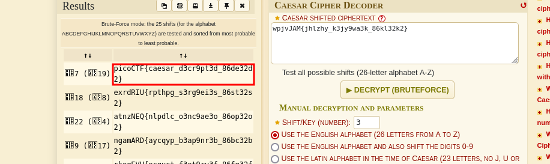

# ANALYSIS
In this challenge we have to decrypt a hidden flag.  
  

# SOLUTION
By opening the file we notice that the text is base64 encoded, so we decode it with an online decoder.  
  

  
  

But the result is not the flag, it is another base64 encoded string. We decode that as well.  
  

  
  

The last encryption type is caesar cipher. We also use an online tool and decrypt that.  
  

  
  

This way we get the flag.  
  

* Flag: picoCTF{caesar_d3cr9pt3d_86de32d2}
