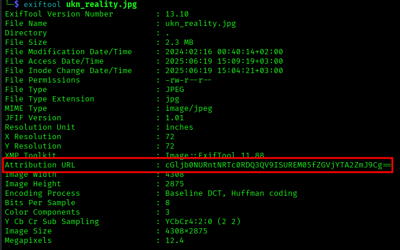

# ANALYSIS
This challenge gives us a file to download, from which we have to extract a flag.  
  

# SOLUTION
The file is in zip format, so we unzip it with the command `unzip unknown.zip`. This way, we get an image. With a tool called ***exiftool*** we can get info about the image, like the author, the creation date, etc. With this command we notice that there is a base64 encoded string.  
  

  
  

With an online decoder we get the flag.  
  

* Flag: picoCTF{ME74D47A_HIDD3N_deca06fb}

