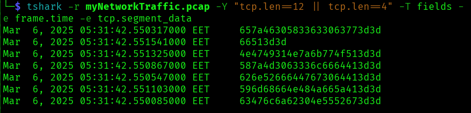
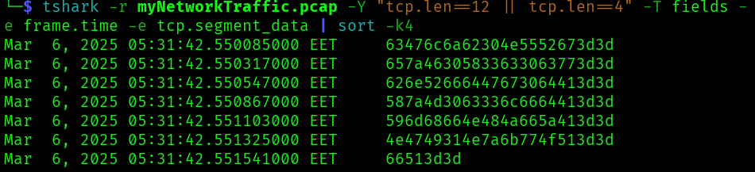
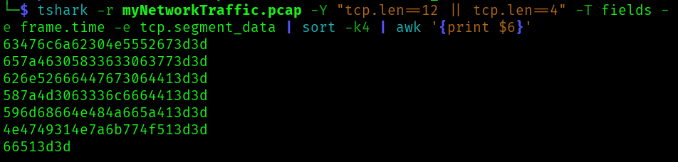
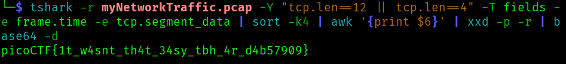

# ANALYSIS
This challenge gives us a .pcap file, which is a file that logs internet traffic. Inside this file there is a flag.  
  

# SOLUTION
When we open it with wireshark we dont anything usefull.  
So, we use `tshark`, a command line tool that is helpful for analyzing .pcap files.  
With the option `-r` we give the file.  
With the option `-Y` we format the packets by their length (tcp.len).  
With the option `T` we add the fields we want to show. Each feild is added with `-e`.  
This way we get the hidden data.  
  

  

Now we have to put them in the right order with the command `sort -k4` (With -k4 we select the forth row).  
  

  
  

At this point we have the right packets but we only have to select the binary data from them with the `awk` command.  
  

  
  

Then, we transform this data from **hex** to **base64** and then we decode the *base64 string*.  
  

  
  

* Flag: picoCTF{1t_w4snt_th4t_34sy_tbh_4r_d4b57909}
