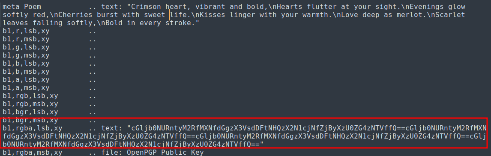

# ANALYSIS
The challenge gives us a .png file, from which we have to get the flag.
  

# SOLUTION
One way to hide data is inside of image files. This technique is called steganography.  
There are many tools to extract hiden data from a .png file, one called `zsteg`. With the command `zteg -a red.jpg` we can get all the hidden info.  
The flag is base64 encoded, so we decode it.

  
To get the flag we can use a tool, like ***cyberchef*** to decrypt the message.
  

  
  

* Flag: picoCTF{r3d_1s_th3_ult1m4t3_cur3_f0r_54dn355_}
