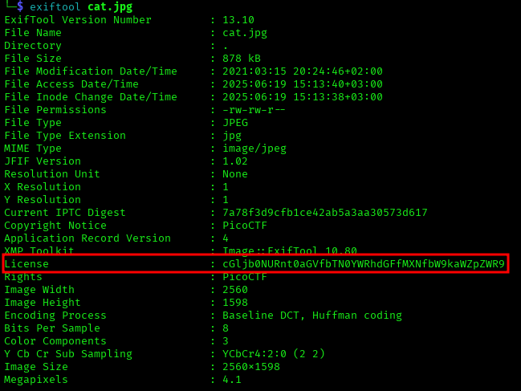

# ANALYSIS
This challenge gives us a file to download, that holds the flag.  
  

# SOLUTION
The first thing we do is to open the image, but we don't get anything out of that. With the tool `exiftool` we can find info about the image like the author, the creation date, etc. We get a strange string on the License category, wich is a base64 encoded string.  
  

  
  
We decode it and get the flag.  
  

* Flag: picoCTF{the_m3tadata_1s_modified}
