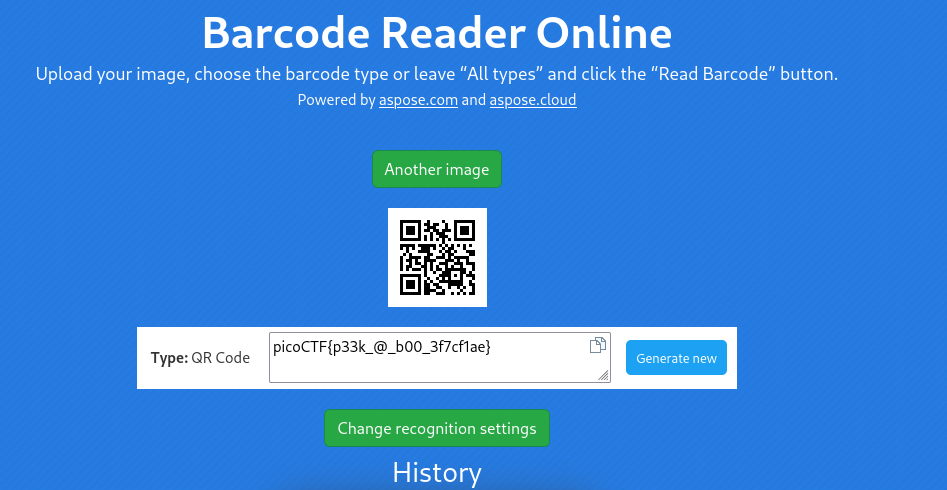

# ANALYSIS
This challenge gives us an image file, as well as a remote server to connect to and get the image. We can download the image to work locally.  
  

# SOLUTION
As soon as we open the image we see a qrcode. We can use an online tool to get the flag.  
  

  
  

* Flag: picoCTF{p33k_@_b00_3f7cf1ae}
