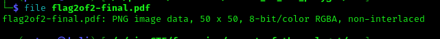
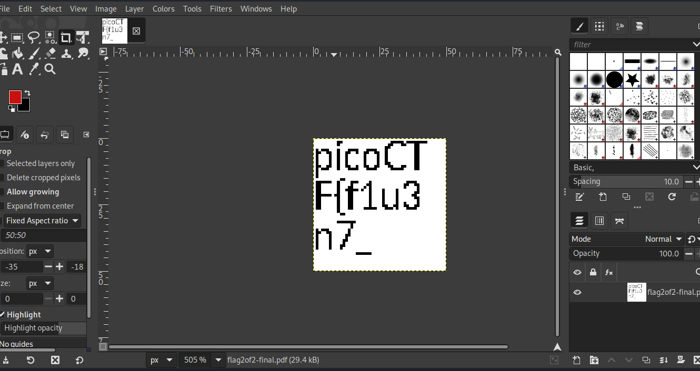

# ANALYSIS
This challenge gives us a file to examine. By downloading it, we see that it is a pdf file.  
  

# SOLUTION
When we open it with a pdf reader, we get the second part of the flag.  
  

  
  

With the command `file <filename>`, we can see the file type. But we get that it is an image (.png).  
  

  
  

So we open it with image reader and we get the first part if the flag.  
  

  
  

* Flag: picoCTF{f1u3n7_1n_pn9_&\_pdf_2a6a1ea8}
