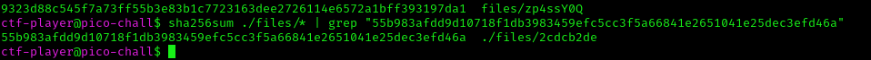

# ANALYSIS
This challenge is running on a remote server, to which we connect through *ssh*. We are also given the hash from the correct file we need to find.  
  

# SOLUTION
To solve this challenge, we first need to connect to the machine. With the `ls` command we can see the files we have to work with, which are the `checksum.txt`, which provides us with the correct hash, the `decrypt.sh`, which decryptes a given file and a folder named `files`, which contains all the files for the challenge.  
To get the sha256 hash of all the files in the directory, we run the command `sha256sum <folder_name>/*`. We pass the result to a grep so that we find the correct file. The final command is:
```bash
sha256sum ./files/* | grep "55b983afdd9d10718f1db3983459efc5cc3f5a66841e2651041e25dec3efd46a"
```
  




After we have the name of the file, we pass it to the decrypt script, with the command 
```bash
./decrypt.sh ./files/2cdcb2de
```

  
  
  

* Flag: picoCTF{trust_but_verify_2cdcb2de}
