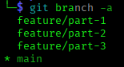
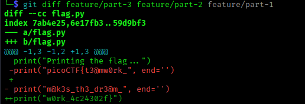

# ANALYSIS
This challenge is related to git commands. From the description we realize that we have to find the files of all the members that collaborate in a git project.  
  

# SOLUTION
With the command `git branch -a` we can see all the branches.  
  

  
  

With the command `git checkout <branch name>` we can switch branch and see this person's work.  

We can also use the command `git diff feature/part-3 feature/part-2 feature/part-1` to get the flag.  
  

  
  

* Flag: picoCTF{t3@mw0rk_m@k3s_th3_dr3@m_w0rk_4c24302f}
