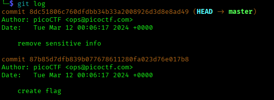
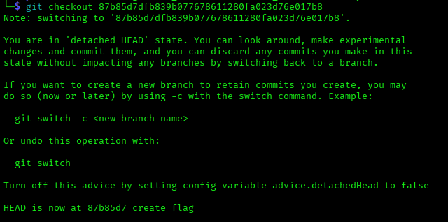

# ANALYSIS
This challenge is related to git commands. From the description, we notice that the flag is probably in the git history.  
  

# SOLUTION
With the command `git log` we can see the history of all the git commits.  
  

  
  

We notice that there was a commit were the flag was created. We change to that version with the command `git checkout 87b85d7dfb839b077678611280fa023d76e017b8`.  
  

  
  

Now in the ***message.txt*** we can see the flag.
  
  

* Flag: picoCTF{s@n1t1z3_ea83ff2a}
