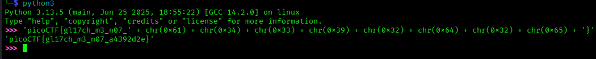

# ANALYSIS
This challenge runs on a remote server, that holds a flag.  
  

# SOLUTION
After we connect with the netcat command given, we see a part of the flag shown. The rest of it is in ascii characters. We can get the full flag by using python.  
  

  
  

* Flag: picoCTF{gl17ch_m3_n07_a4392d2e}