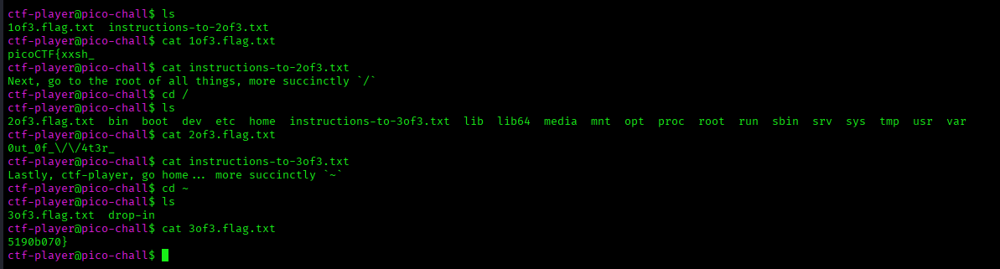

# ANALYSIS
In this challenge, we need to connect to a remote server via *ssh*.  
  

# SOLUTION
The command to connect is given to us when we start the instance, by using the given password. As seen below, we follow the steps to get the flag.  
  

  
  

* Flag: picoCTF{xxsh_0ut_0f_\/\/4t3r_5190b070}
