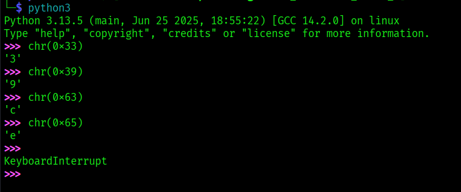

# ANALYSIS
This challenge gives us two files, one having the encrypted flag and one that contais the source code.  
  

# SOLUTION
To get the flag we need to pass the correct key. To find the key, we can open the python script and get the values of the key characters.  
  

  
  

* Flag: picoCTF{tr45h_51ng1ng_502ec42e}
