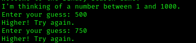
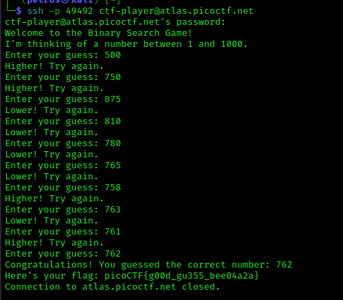

# ANALYSIS
THis challenge is running on a remote server and it also gives us an *sh* file. From the file, we notice that we have to play a guessing game. We need to guess a number from 1 to 1000 with only 10 tries. Each time we are told if the number is higher or lower than our guess.  
  

# SOLUTION
First of all, we have to connect to the server.  
One clsasic strategy is to give numbers in the middle so that we remove large spaces. We start with 500, which divides the game into to spaces.  
For example, as seen below i gave 500 and i got Higher. So, next time i choose 750.  
  

  
  

This way we win the game in 9-10 tries.  
The game might be played more than once.  
  

  
  

* Flag: picoCTF{g00d_gu355_bee04a2a}
