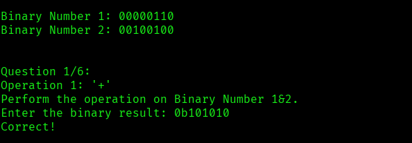
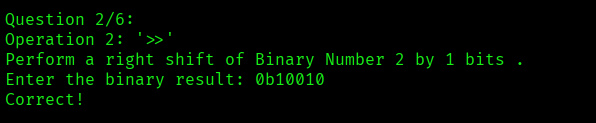
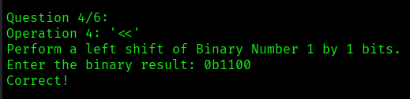
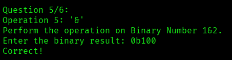
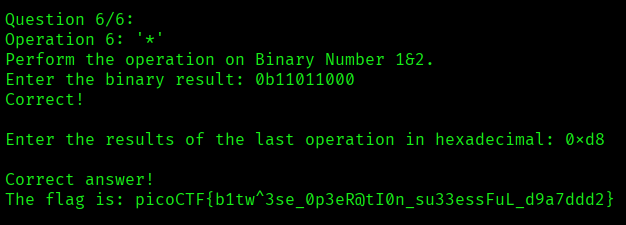

# ANALYSIS
This challenge gives us some binary calculations we need to operate, so that we get a flag.  
  

# SOLUTION
First of all, we need to do addition `+`.  
  

  
  

Then, it is a right shift on number 2 by 1 bit.  
  
  
  
The third calculation is with the symbol `|`, which is an OR operator between the digits of each number.  
For example, if we have `1`, it stays `1`, otherwise `0`.  
  

  
  
The fourth calculation is a left shift on number 1 by 1 bit.  
  

  
  

The fifth calculation is with the symbol `&`, which is a binary AND.  
For example, we get `1` only if we have two `1`, otherwise `0`.  
  

  
  

The sixth and final calculation is a multiplication `*`. At the end we are asked for its hex value.  
  

  
  

* Flag: picoCTF{b1tw^3se_0p3eR@tI0n_su33essFuL_d9a7ddd2}