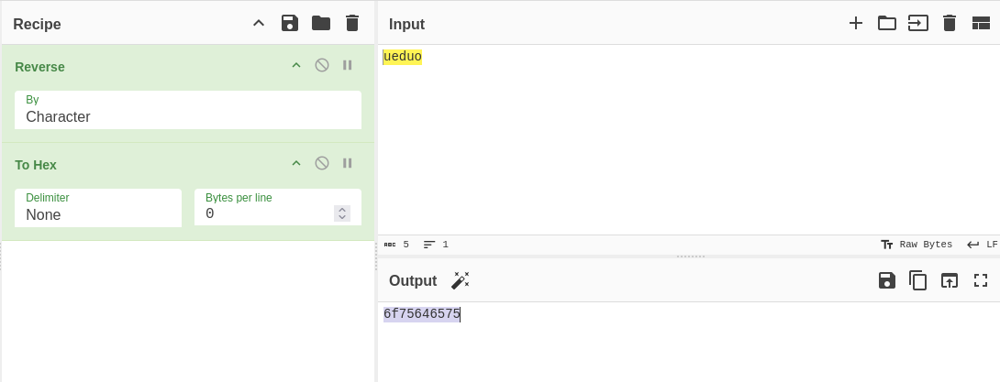
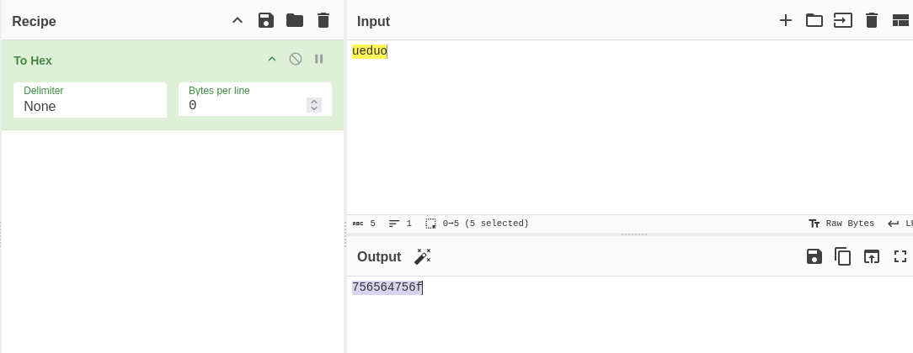

# ANALYSIS
The challenge gives us a C source code file. We are asked to transform a word to little endian and big endian.  
  

# SOLUTION
The tool we are going to use is cyberchef. To transform to little endian, we need to pass in **Reverse** and **To Hex**.  
  

  
  

This way, for the big endian we inly need the field **To Hex**.  
  

  
  

* Flag: picoCTF{3ndi4n_sw4p_su33ess_cfe38ef0}
