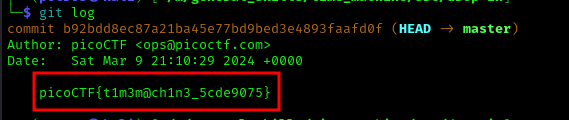

# ANALYSIS
This challenge gives us a zip file, which contains a git folder.  
  

# SOLUTION
We have to see the information of all commits. This can be done with the `git log` command. This way we get the flag.  

  
  

* Flag: picoCTF{t1m3m@ch1n3_5cde9075}
