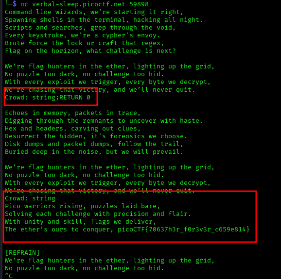

# ANALYSIS
This challenge provides a connection to a remote server, which spits out a poem with a hidden verse. In this verse, the flag is located.  
  

# SOLUTION
In the source code given, there can be found a location where a user can enter unsanitized input. In the program, we can also give the `RETURN` command, which returns in a specific line of the poem. But if we enter only this command it will e parsed as a string. So we give a string first and then **RETURN 0**.  
Full Command: `string;RETURN 0` 
  

  
  

* Flag: picoCTF{70637h3r_f0r3v3r_c659e814}
