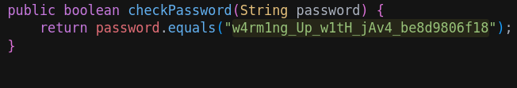

# ANALYSIS
This challenge gives us a java file.  
  

# SOLUTION
First of all, we open the file with a text editor. We notice that the password is in the functio **checkPassword()**.  
  

  
  
Before calling this function, this string is passed in the format picoCTF, so we get the full password and flag.  
  

* Flag: picoCTF{w4rm1ng_Up_w1tH_jAv4_be8d9806f18}
