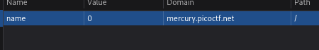

# ANALYSIS
This challenge is running on a web server, that handles cookies.  
  

# SOLUTION
After inspection, we notice that every time we give a cookie type, the result changes. For example, the cookie starts from the value -1. By giving **snickerdoodle** the value changes to 0.  
  

  
  
Then, we change the cookie values to 2, 3, 4, etc. and refresh the page. We notice that every time the cookie name changes as well. The flag is the cookie value 18.  
  

* Flag: picoCTF{3v3ry1_l0v3s_c00k135_94190c8a}
