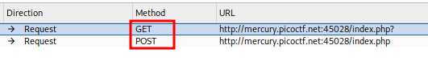

# ANALYSIS
This challenge is running on a web server, where a flag is located.  
  

# SOLUTION
When we get to the webpage, we see two colors but when pressing each one nothing changes. We can use burpsuite to look at the requests more closely. At first, we intercept both requests of the colors. Their difference relies on the method used.  
  

  
  
Maybe if we give another method, we will get the flag. From the challenge title, we assume that the correct method is HEAD.  
  

  
  

* Flag: picoCTF{r3j3ct_th3_du4l1ty_775f2530}
