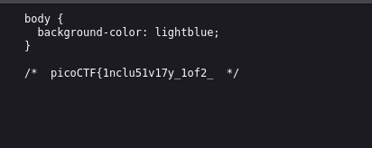
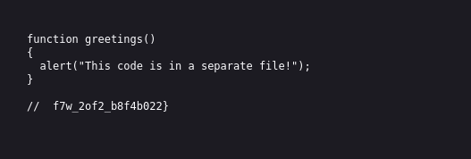

# ANALYSIS
This challenge is running on a web server, where we need to find a flag.  
  

# SOLUTION
The flag is divided in two files, the **style.css** and **script.js**.  
  

  
  
  
  
  

* Flag: picoCTF{1nclu51v17y_1of2_f7w_2of2_b8f4b022}