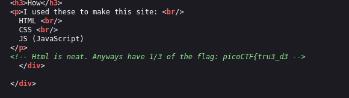
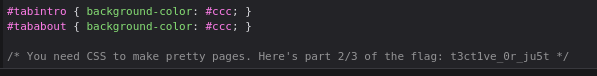
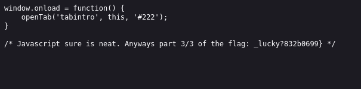

# ANALYSIS
This challenge is running on a web server, that we need to inspect.  
  

# SOLUTION
From th code inspection we get:
the first flag part is in the html source code **(Ctrl+U)**  
  

  
  
the second part is in the style editor **(ctrl+shift+I)**  
  

  
  
the third and last one is in a javascript file **(ctrl+shift+Ε AND Refresh)**.  
  

  
  

* Flag: picoCTF{tru3_d3t3ct1ve_0r_ju5t_lucky?832b0699}
