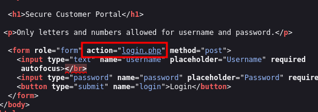
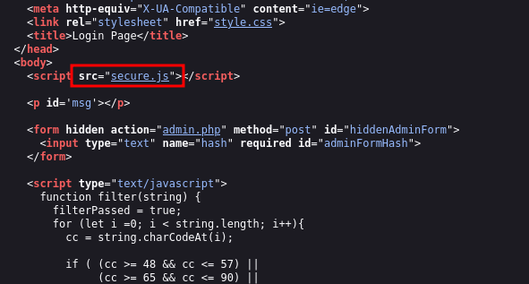

# ANALYSIS
This challenge is running on a web serbver, which is asking for credentials, that we don't have.  
We need to connect to get the flag.  

# SOLUTION
First, we need to check if the creds are laying around somewhere on the webpage and if the php code is available. We notice that we can see the login code.  

  
  

We see that there is a hidden function, which might have the code.  
  

  
  

When we open it we get the admin credentials, so we connect and get the flag.  
  

* Flag: picoCTF{j5_15_7r4n5p4r3n7_05df90c8} 

