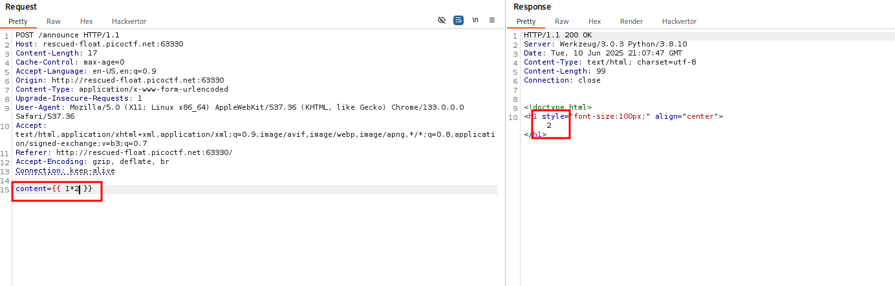
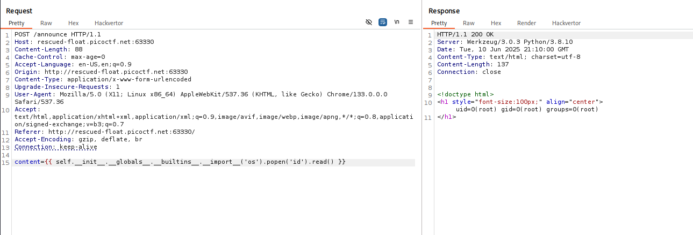
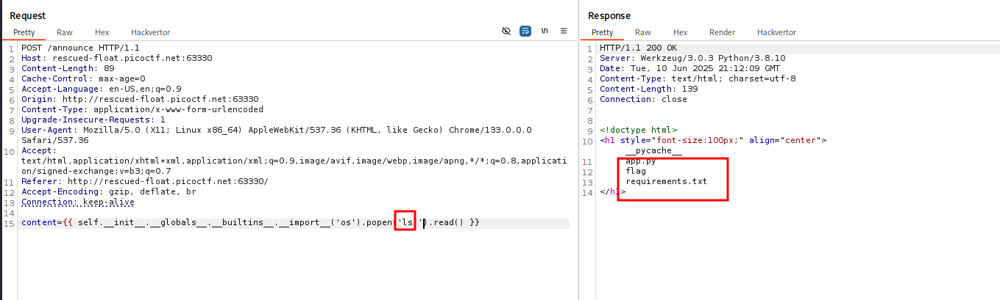
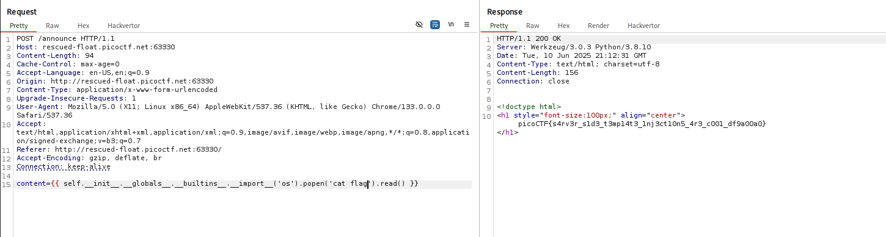

# ANALYSIS
This challenge runs on a webserver, where you we can announce a message. From the challenge name, we can assume that we have to do Server Side Template Injection.

# SOLUTION
First of all, we have to find out what template service is running on the server. After some analysis we come to the conclusion that it is ***jinja***. Then, just from googling we found out that there is an opportunity of remote command execution (RCE). 

With the same way, we can find the flag and get its content.

* Flag: picoCTF{s4rv3r_s1d3_t3mp14t3_1nj3ct10n5_4r3_c001_df9a00a0}
