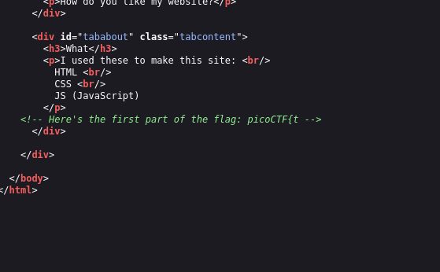
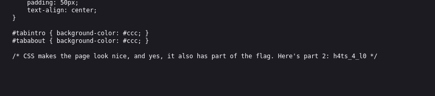
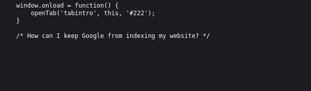
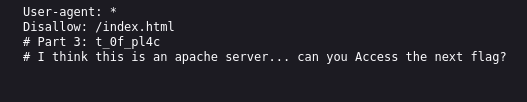
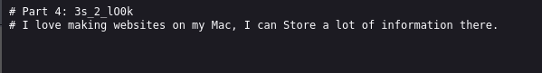
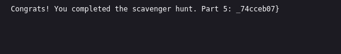

# ANALYSIS
This challenges is running on a web server, that holds a flag. We have to find all of its 5 parts.  
  

# SOLUTION
First of all, we view the html source code, where the first part is located.  
  

  
  

Th second part is in the css code.  
  

  
  
The next one is in the javascript code. There, we are told that the next part is in robots.txt.  
  

  
  
In the robots.txt we find the third part and a hint for the fourth.  
  

  
  
The apache server file is called **.htaccess**. It is the file that has the fourth part and a hint to the fifth.  
  

  
  
The mac's store is in the file **.DS_Store**, where the last part is located.  
  

  
  

* Flag: picoCTF{th4ts_4_l0t_0f_pl4c3s_2_lO0k_74cceb07}
