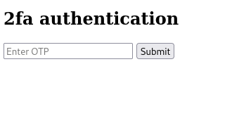
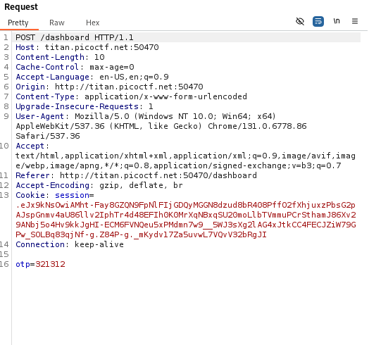
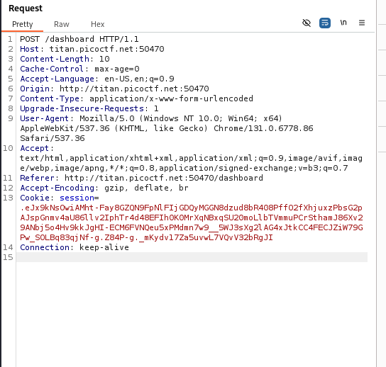

# ANALYSIS
The challenge runs on a web server, from which we have to get a flag. By opening the web page we are asked to put some creds. After giving test creds, we get to an OTP page.  
  

  
  

# SOLUTION
In this challenge we have to bypass the OTP. We can open burpsuite and catchs the packet that sends the OTP password.  
  

  
  

In this we delete the part with the OTP.  

  
  

This way we send the request and get the flag.  
  

* Flag: picoCTF{#0TP_Bypvss_SuCc3$S_2e80f1fd}
