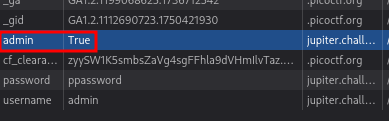

# ANALYSIS
This challenge is running on a web server, which asks for credentials to get the flag.  
  

# SOLUTION
Access to the flag only have users in the Administrators Group. We notice that there is a cookie value about the admin role.  
  

  
  

We switch it to **True** and refresh the page.  
  

  
  
This way, we get the flag.  
  

* Flag: picoCTF{th3_c0nsp1r4cy_l1v3s_6edb3f5f}
