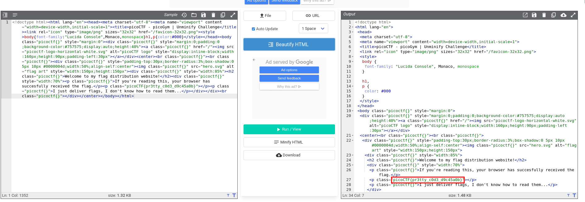

# ANALYSIS
This challenge runs on a web server, from which we have to get the flag.  
  

# SOLUTION
To solve this challenge, we use a **code formatter**, to unscramble the code. This way we can read the flag easier.  
  

  
  

* Flag: picoCTF{pr3tty_c0d3_d9c45a0b}
