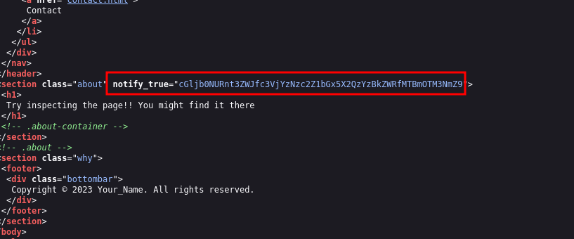
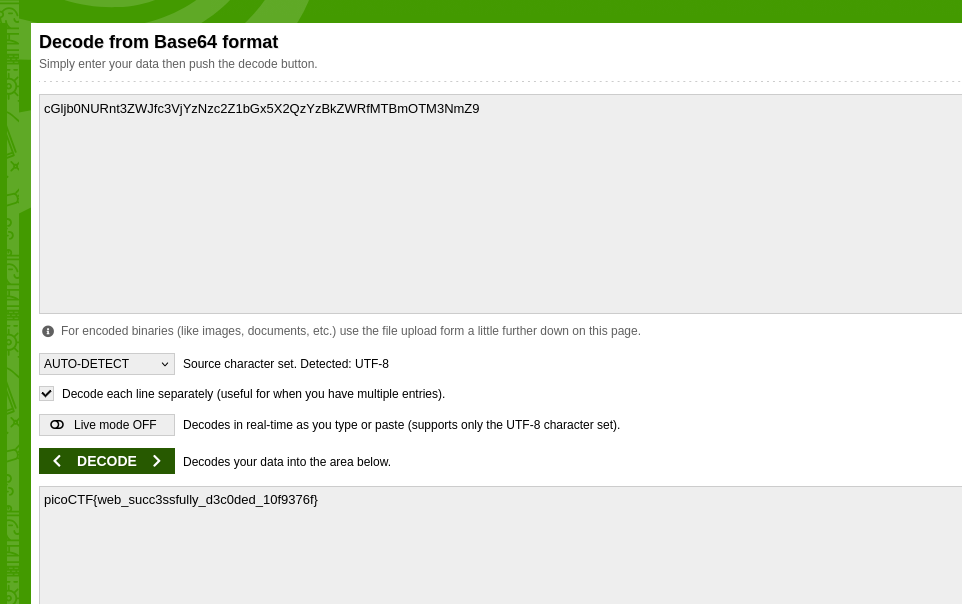

# ANALYSIS
This challenge runs on a web server, from which we have to obtain a flag.  
  

# SOLUTION
After we open he webpage, we inspect the html ource code, but we can't find anything. So we look at other html pages like the about. There we find a strange string.  
  

  

We notice that it is base64 encoded, so we search on the internet for a decoder and we get the flag.  
  

  
  

* Flag: picoCTF{web_succ3ssfully_d3c0ded_10f9376f}
