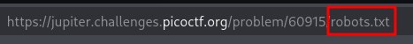

# ANALYSIS
This challenge is running on a web server, where a flag is located.  
  

# SOLUTION
From the description, we get that the flag might be in the robots.txt file. We go there and we find another file, which is the one that actually contains the flag.  
  

  
  

* Flag: picoCTF{ca1cu1at1ng_Mach1n3s_8028f}
